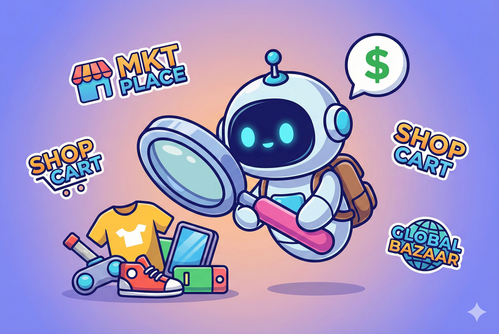
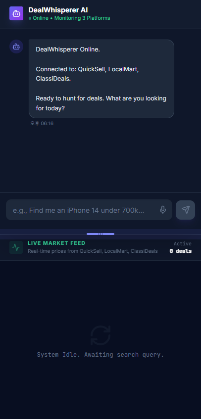
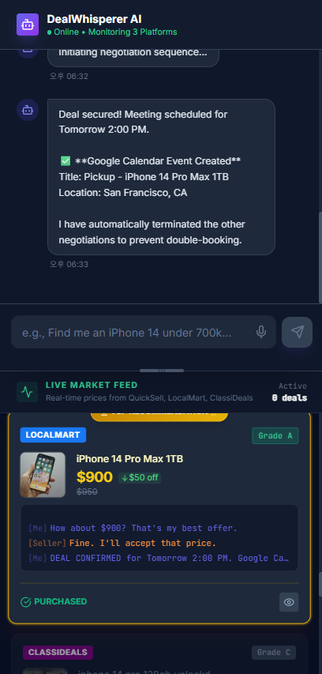

# Run and deploy your AI Studio app

This contains everything you need to run your app locally.

## Demo Video

## Live Demo

**Try it now:** https://dealwhisperer-448811452626.us-west1.run.app/

View your app in AI Studio: https://ai.studio/apps/drive/1Uct7BrFtxfDinyAr1ThvP8zuBeJnD5V9

## Run Locally

**Prerequisites:**  Node.js

1. Install dependencies:
   `npm install`
2. Set the `GEMINI_API_KEY` in [.env.local](.env.local) to your Gemini API key
3. Run the app:
   `npm run dev`

## Testing Instructions

1. **Search for an item:** Type `iphone 14` in the chat and press Enter
2. **Start negotiation:** When the AI asks if you want to negotiate, type `yes`
3. **Watch negotiations:** AI agents will automatically negotiate with sellers one by one — browse the prices in the dashboard while waiting
4. **Choose your deal:** When you find a deal you like (status: "Offer Received"), click the **Confirm** button
5. **Schedule pickup:** Select a pickup time to finalize the deal
6. **Done!** The deal is confirmed and synced to Google Calendar
